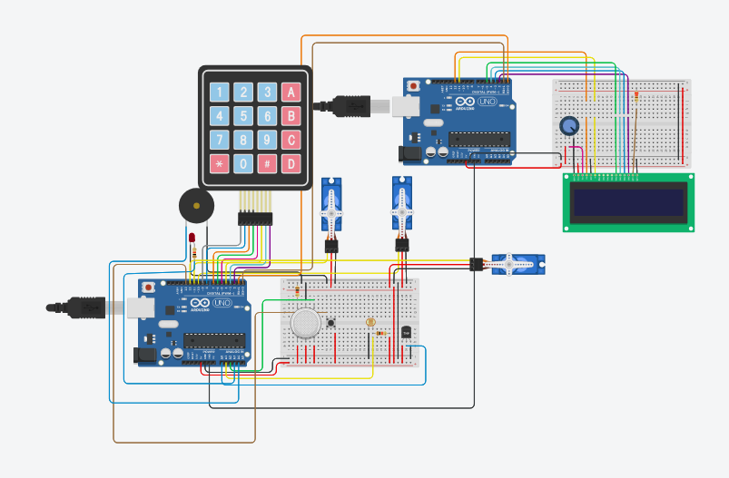

# Projeto Arduino - IntelligentLockSystemProject

Projeto semestral da matéria de Computação Móvel, ministrada no Centro Universitário FEI. Consiste em sistema inteligente de travas para portas e janelas, desenvolvido para arduino. Utiliza-se sensores de luz, temperatura, fumaça e keypad de senha para determinar de forma automática a abertura e fechamento dessas travas.

## Funcionalidade

Abaixo há um link de um vídeo postado no youtube demonstrando o funcionamento geral do sistema

## Execução

O projeto foi desenvolvido na plataforma tinkercad e para executa-lo, basta abrir o link abaixo e executar o projeto.

https://www.tinkercad.com/things/2Nrr1BGmxGP
